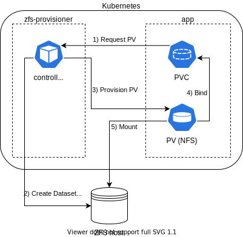
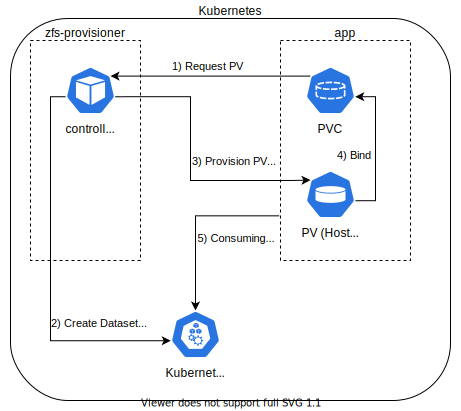

# Dynamic ZFS provisioner for Kubernetes

[][build]

[][releases]
[][releases]

kubernetes-zfs-provisioner is a dynamic ZFS persistent volume provisioner for Kubernetes.
It creates ZFS datasets via SSH on remote hosts and shares them via [NFS][nfs] to make them mountable to pods.



Alternatively, if the ZFS hosts are part of the cluster, [HostPath][hostpath] is also possible,
but the `PersistentVolume` objects will have a [NodeAffinity][node affinity] configured.



Currently all ZFS attributes are inherited from the parent dataset.

For more information about external storage in kubernetes, see
[kubernetes-sigs/sig-storage-lib-external-provisioner][lib provisioner].

## Installation

Recommended option is the [Helm Chart][helm chart].

## Configuration

The provisioner relies on an already set up Zpool and a dataset by the administrator.
It also needs **SSH access** to the target ZFS hosts, i.e. mount the SSH private key and
config to the container so that the executing user can find it.

### Provisioner

By **default the container image should work out of the box** when installed in the cluster.
The only thing to configure is SSH, the [Helm Chart][helm chart] should help you with that.

The provisioner can be configured via the following environment variables:

| Variable | Description | Default |
| :------: | :---------- | :-----: |
| `ZFS_METRICS_PORT` | Port on which to export Prometheus metrics. | `8080` |
| `ZFS_METRICS_ADDR` | Interface binding address on which to export Prometheus metrics. | `0.0.0.0` |
| `ZFS_KUBE_CONFIG_PATH` | Kubeconfig file path in which the credentials and API URL are defined. | `` |
| `ZFS_PROVISIONER_INSTANCE` | The instance name needs to be unique if multiple provisioners are deployed. | `pv.kubernetes.io/zfs` |

The provisioner instance name is also stored as a ZFS user property in the created
dataset of the form `io.kubernetes.pv.zfs:managed_by` for system administrators, but is not
further significant to the provisioner.

### Storage Classes

The provisioner relies on properly configured storage classes. The following shows an example
for the [HostPath][hostpath] type.

```yaml
kind: StorageClass
apiVersion: storage.k8s.io/v1
metadata:
  name: zfs-hostpath
provisioner: pv.kubernetes.io/zfs
reclaimPolicy: Delete
parameters:
  parentDataset: tank/kubernetes
  hostname: storage-1.domain.tld
  type: hostpath
  node: storage-1 # the kubernetes.io/hostname label if different than hostname parameter (optional)
```

Following example configures a storage class for ZFS over [NFS][nfs]:
```yaml
kind: StorageClass
apiVersion: storage.k8s.io/v1
metadata:
  name: zfs-nfs
provisioner: pv.kubernetes.io/zfs
reclaimPolicy: Retain
parameters:
  parentDataset: tank/kubernetes
  hostname: storage-1.domain.tld
  type: nfs
  shareProperties: rw,no_root_squash # no_root_squash by default sets mode to 'ro'
```
For NFS, you can also specify other options, as described in [exports(5)][man exports].

## Notes

### Reclaim policy

This provisioner supports the `Delete` and `Retain` reclaim policies, with `Delete` being
default if unspecified. The reclaim policy is also stored as ZFS user property of the form
`io.kubernetes.pv.zfs:reclaim_policy` for system administrators, but is not
further significant to the provisioner.

### Storage space

The provisioner uses the `refreservation` and `refquota` ZFS attributes to limit
storage space for volumes. Each volume can not use more storage space than
the given resource request and also reserves exactly that much. This means
that over provisioning is not possible. Snapshots **do not** account for the
storage space limit, however this provisioner does not do any snapshots or backups.

See [zfs(8)][man zfs] for more information.

### Security

First of all, no warranties and use at own risk.

Making a container image and creating ZFS datasets from a container is not exactly
easy, as ZFS runs in kernel. While it's possible to pass `/dev/zfs` to a container
so it can create and destroy datasets within the container, sharing the volume with NFS
does not work.

Setting `sharenfs` property to anything other than `off` invokes [exportfs(8)][man exportfs],
that requires also running the NFS Server to reload its exports. Which is not the case
in a container (see [zfs(8)][man zfs]).

But most importantly: Mounting `/dev/zfs` inside the provisioner container would mean that
the datasets will only be created on the same host as the container currently runs.

So, in order to "break out" of the container the `zfs` calls are wrapped and redirected
to another host over **SSH**. This requires SSH private keys to be mounted in the container
for a SSH user with sufficient permissions to run `zfs` commands on the target host.

Example sudoers file in `/etc/sudoers.d/zfs-provisioner` (On the ZFS host):
```
zfs-provisioner ALL=(ALL) NOPASSWD:/sbin/zfs *,/bin/chmod *
```

For increased performance and security install ZFS on all Kubernetes nodes thats should
provide ZFS storage. Then it's possible to create `PersistentVolume` objects with [HostPath][hostpath].
This eliminates network latency over unencrypted NFS, but schedules the pods to the ZFS hosts only.

## Development

### Requirements

* go
* docker
* ZFS and NFS (run `make install:zfs` on Debian/Ubuntu if not already installed)

### Building and Testing

Run `make help` to see which target does what.

## Troubleshooting

### Filesystem created, but not shared

```
controller.go:920] error syncing claim "56ea786a-e376-4911-a4b1-7b040dc3537f": failed to provision volume
with StorageClass "zfs-retain-pve-1": creating ZFS dataset failed: exit status 1:
"/usr/bin/zfs zfs create -o sharenfs=rw,no_root_squash ... tank/kubernetes/
pvc-56ea786a-e376-4911-a4b1-7b040dc3537f" => cannot share 'tank/kubernetes/
pvc-56ea786a-e376-4911-a4b1-7b040dc3537f': share(1M) failed
filesystem successfully created, but not shared
```

This happens when the dataset got created, but invoking `zfs share` is failing.
Most likely because from [zfs(8)][man zfs] it's stated that [exportfs(8)][man exportfs] is invoked, which talks to the NFS server.

So, have you got `nfs-kernel-server` installed on the host and is `exportfs` available?

Once you solve this, destroy the dataset again, as the following retries will fail forever:

```
cannot create 'tank/services/kubernetes/pvc-56ea786a-e376-4911-a4b1-7b040dc3537f': dataset already exists
```

## Credits

Thanks to [Gentics][gentics] for open sourcing the [initial version][gentics repo]!

I (@ccremer) have been allowed to take over maintenance for this repository.


[build]: https://github.com/ccremer/kubernetes-zfs-provisioner/actions?query=workflow%3ATest
[releases]: https://github.com/ccremer/kubernetes-zfs-provisioner/releases
[node affinity]: https://kubernetes.io/docs/concepts/storage/persistent-volumes/#node-affinity
[lib provisioner]: https://github.com/kubernetes-sigs/sig-storage-lib-external-provisioner
[hostpath]: https://kubernetes.io/docs/concepts/storage/volumes/#hostpath
[nfs]: https://kubernetes.io/docs/concepts/storage/volumes/#nfs
[man zfs]: https://linux.die.net/man/8/zfs
[man exportfs]: https://linux.die.net/man/8/exportfs
[man exports]: https://linux.die.net/man/5/exports
[helm chart]: https://ccremer.github.io/charts/kubernetes-zfs-provisioner/
[gentics]: https://www.gentics.com/genticscms/index.en.html
[gentics repo]: https://github.com/gentics/kubernetes-zfs-provisioner
